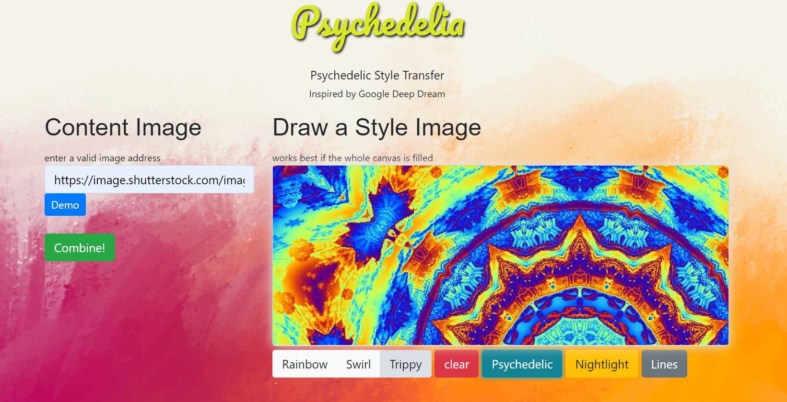
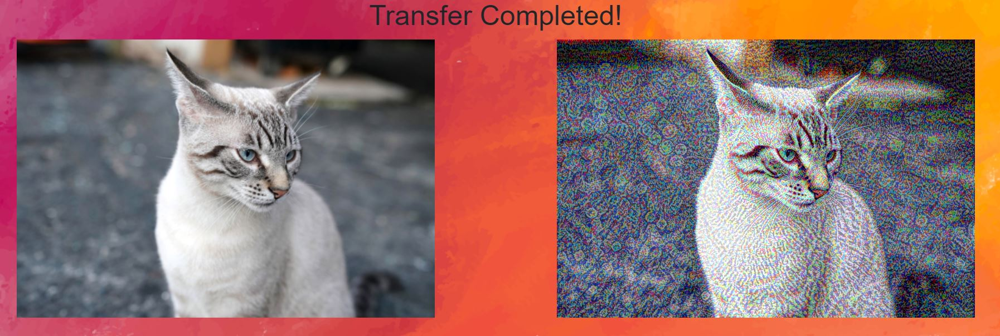

# Psychedelia
Psychedelic style transfer with user input content image url and canvas drawing/photo import style image.
Style transfer allows for the color/texture/shapes of one image (style image) to be placed onto the subjects/things of the content image.

## Demo

### Start screen

### Results

## Experience
The user enters the webpage and sees inputs of content and style image for the style transfer. They can insert an image url from the web for the content image. For the style image, they can either draw one or use one of the three provided image styles.
Clicking submit will run the style transfer algorithm and output a side by side comparison of content image with the transferred image.

# Technical
## Views (single page)
- Home 

## Routes
- /
  - GET home.html
- /transfer/
  - POST user input data (url of content image, base64 url of style image)
- /reset/
  - POST output data (target image and resized content image)

## Features
- Input for links (content image)
- Canvas for freehand drawing of style image
- Option to choose image for style image
- Results displays comparison
- Demo available
- Adjustable number of steps during training

## Languages

#### Front-End
* HTML
* CSS
* JavaScript
* Bootstrap

#### Back-End
* Flask
* PyTorch
* AWS S3 for transferred image storage

## Planning
- Week One
  - Thursday April 9, 2020
    - Planning routes and functionalities
    - Create front end skeleton
  - Friday April 10, 2020
    - Finish Frontend
    - Form API connection
- Week Two
  - Sunday April 26, 2020
    - Implement style transfer algorithm in PyTorch
    - Connect to S3 using Boto
  - Monday April 27, 2020
    - Fix canvas bugs, add canvas features
    - Deployment
  
  
